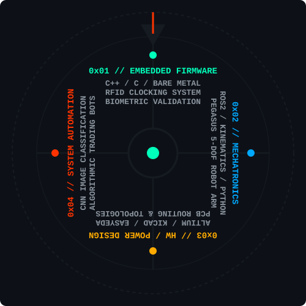

  

  <samp>PROFESSION: MECHATRONICS ENGINEER // USER ID: mmm404</samp>

---

## GRAPHICAL DIAGNOSTIC SELECTOR // TECHNICAL MATRIX

  

---

## TARGET LAB INVENTORY

* **EMBEDDED HARDWARE:** Arduino Ecosystem, Bare-metal register manipulation, low-level architecture execution, Assembly (ARM/x86), C, C++.
* **ECAD DESIGN WORKFLOW:** Board layout synthesis, routing differential signals, component mapping within Altium Designer, KiCad, and EasyEDA.
* **AUTOMATION & DATA ENGINES:** Python analytics pipelines, Convolutional Neural Networks (CNN) for machine vision processing, ROS2 hardware stacks.
